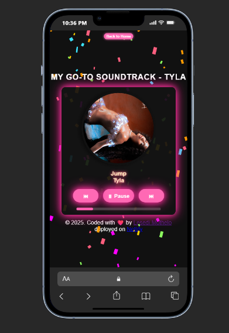

Music-Player🎶
This is a simple music player app I built using HTML, CSS, and JavaScript. It is responsive across multiple devices. It features my go-to soundtrack, showcasing songs by Tyla — one of my favorite artists.
Tyla’s music inspires me because of her authenticity, artistry, and the way she blends global influences into something fresh and powerful. I wanted to create a player that not only lets me listen to her songs but also reflects how much her artistry motivates me.

Features✨
-Play, pause, skip, and control tracks
-Responsive design – works seamlessly on desktops, tablets, and mobile devices
-Clean and minimal UI with confetti all over the page

Technologies Used🛠
-HTML – structure of the music player
-CSS – styling and layout
-JavaScript – functionality and interactivity

Inspiration🚀
This project is both a practice in front-end web development and a tribute to Tyla’s artistry.                                                                                        Music and design both fuel my creativity, so combining them felt like the perfect project.

Future Improvements🔮 
-Planned enhancements for the music player:
-Add a playlist feature to manage multiple songs easily
-Implement shuffle and repeat modes for flexible playback
-Add volume control and a progress bar controller for more control over playback

Screenshot📸

